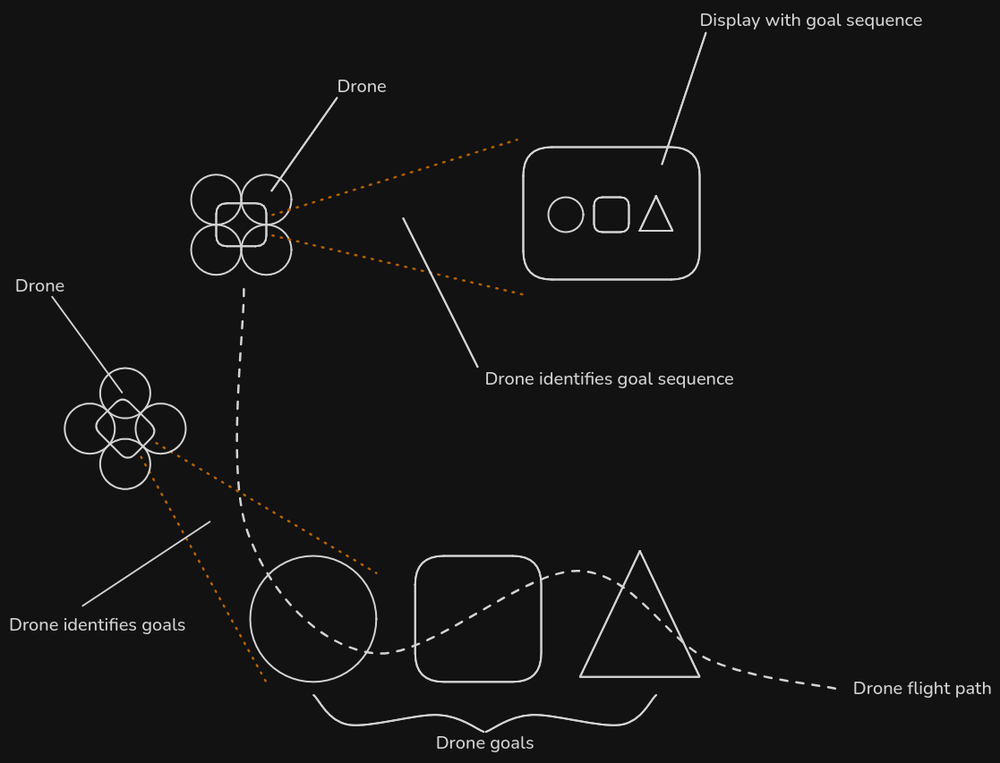

# Project Requirements

## "Marketing Requirements"

- The drone must be an autonomous indoor drone
- The drone must be lightweight (<250g)
- The drone must be safe to fly in a demonstration environment
- The drone must be able to recognize circle, triangle, square symbols
- The drone must be able to find and fly autonomously through circle, triangle, square goals, in the order of shapes shown
- The drone must be able to fly long enough to find and go through the goals
- The drone must have an emergency-stop system available
- The drone must be resilient to high wireless interference, in a demonstration hall environment

## Engineering Requirements informal draft

- Total weight <250g
    - yes this means 249g max. not 250g (by FAA regulations, at least)
    - [The FAA requires drones weighing 250g or more to be registered*](https://www.faa.gov/uas/getting_started) ($5, but probably more hassle for a DIY) - **[This only applies to outdoor flight. indoor flight is unregulated](https://www.faa.gov/faq/do-faa-rules-and-regulations-apply-commercial-uas-or-drone-operations-conducted-indoors-only#:~:text=FAA%20rules%20and%20regulations%20apply%20to%20operations%20conducted%20outdoors%20in%20the%20National%20Airspace%20System)**
    - Outdoor recreational flight under 250g does not require FAA registration, but there are additional rules
    - [UK campus police say no drones allowed (presumably indoor _or_ outdoor) without Event Management Office permission](https://police.uky.edu/unmanned-aircraft-systems-uas)
    - There are some additional conditional restrictions on outdoor flight, even if under 250g, that may require permission (Kroger Field, LEX airport both have possible conditional no-fly restrictions)
    - If we stick to indoor there should be no issues. 250g is still a challenging but acheiveable limit for the project.
- Capable of stable flight
    - indoors, so no worry about wind
    - stable and controllable
    - top speed TBD
    - safe for spectators (rotor guards?)
    - appropriate sensors to orient itself and calculate proper output
- Total development cost below project budget
    - total budget to be confirmed
- Vision system that can identify circle, square, triangle
    - quickly and while moving (specific spec TBD)
- Identification and tracking of circle, square, triangle goals
- Capable of Autonomous operation
    - startup, takeoff, sequence identification, sequence execution, landing
    - no human interaction except the selection and display of the sequence
- Capable of manual operation
    - for testing and setup
    - for basic flight demonstration
- Flight time of 5-10 minutes
    - negotiable, but probably 5min minimum?
    - this is long enough to do at least one iteration of the demo
- Telemetry and logging
    - livestream telemetry data to a base-station device
    - testing, tuning, and debugging
    - log to an onboard sd card black-box
    - resilient to heavy rf interference from campus wifi, other demos, etc
    - vision system can have its own logging system, to seperate deterministic and non-deterministic systems
- Software simulation
    - for concurrent hardware and software design and iteration, the flight-control firmware should be able to be fully simulated independant of hardware
- verify project requirements:
    - where is the line for make vs buy?
        - flight controller? - I think we could definitely do this one
        - motor ESCs? - We could possibly do this one, but that would make this a much more difficult project. it would be fun tho, bldc foc escs are cool
        - chassis? this is easy enough to 3d print, so reasonable to say build this

# User Story
> Drone is powered on. Drone boots up, waits a few seconds, then beeps to indicate that it is ready to take off. The drone takes off, then finds the 3 symbols (circle, square, triangle) in some user-defined sequence. The drone finds the first goal, then flies through it. The drone repeats the process for the other two goals. The drone finds a safe space to land, then lands itself. The user can then retrieve the onboard SD card black-boxes to verify the onboard sensor data and vision captures.

# Impacts and Considerations

I don't remember all of the categories for this

## Safety
Blade guards may be needed for spectator/operator safety.
